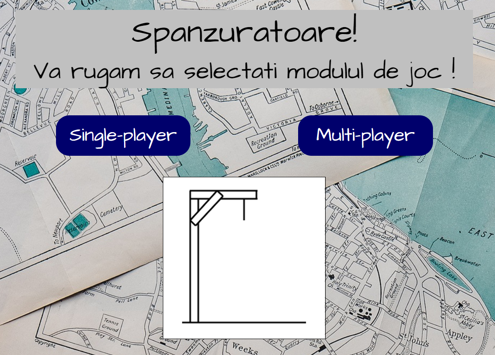
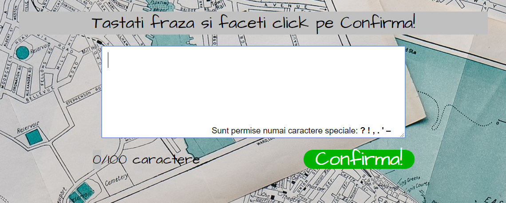
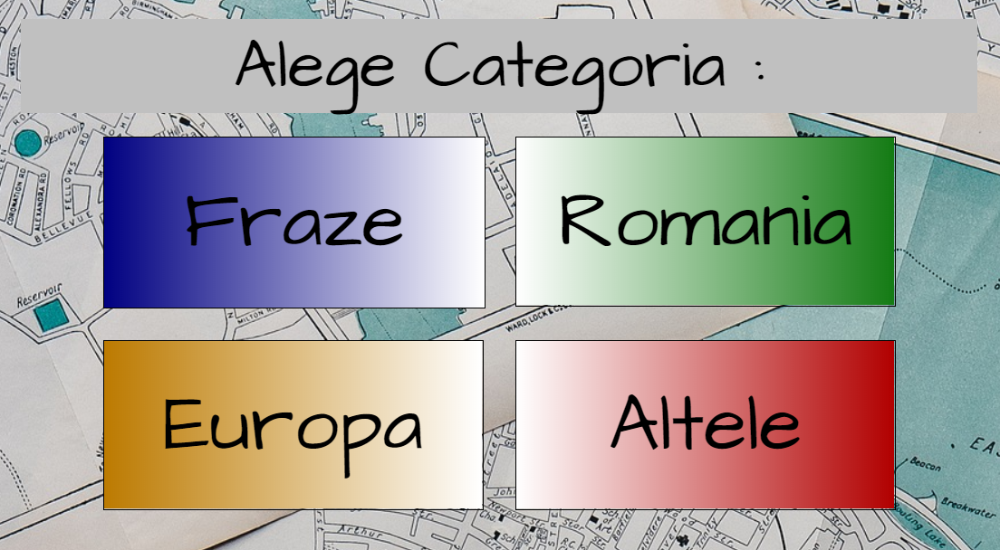
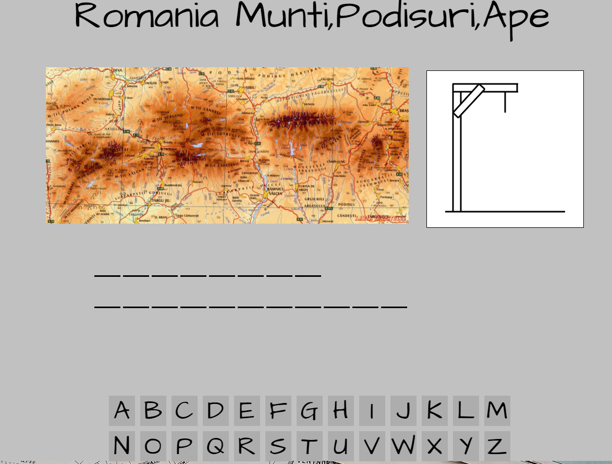
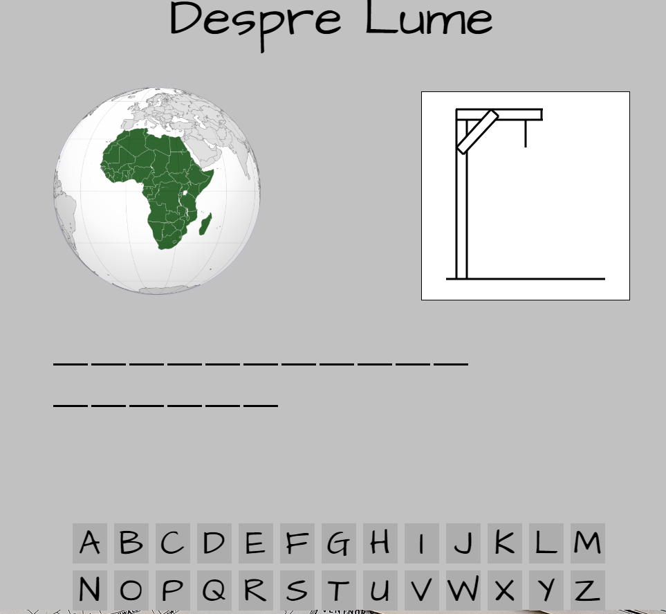

# SpanzuratoareaGeografie

Tot ce trebuie sa faceti este sa accesati link-ul de mai jos:

https://riri0411.github.io/SpanzuratoareaGeografie/

Site este destinat utilizarii in scop educational, elevilor de gimnaziu, si nu numai, pentru a invata geografie. Este free utilizarii.

Jocul se numeste Spanzuratoarea, cel bine cunoscut de toti. Are 2 module: single-player si multi-player.

In modul multi-player poti alege un test de maxim 100 de caractere, care urmeaza sa fie ghicit.

In modul single-player poti alege una dintre cele 4 categorii, dupa care vei primi aleatoriu una dintre cuvintele/frazele prestabilite, pe care tu v-a trebui sa il ghicesti.

Multi-player

Single-player

Si 2 exemple

